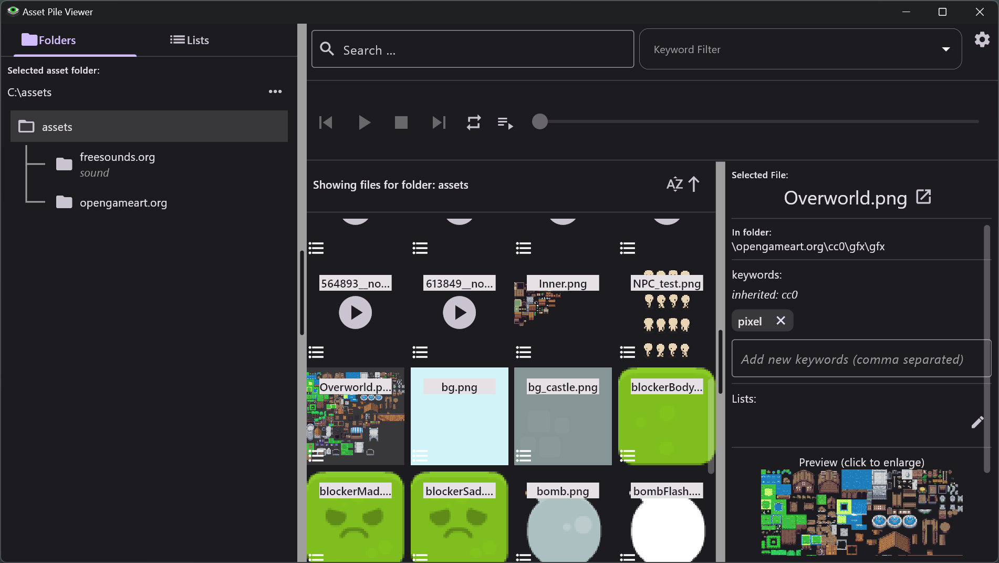

# Asset Pile Viewer

The Asset Pile Viewer is a utility that allows you to preview your assets in one window.  Just select a folder where all your assets are located and you can begin playing sounds and viewing images.  You can also filter the file list with a search term or filter on keywords.  Keywords can be added to files, or to folders for search and organization.

Features include:

  * Previewing all assets under a selected folder
  * Adding keywords to folders and files
  * Filter assets by file name and keywords
  * Supports Windows and Linux.

## Supported File Formats
The following file formats are currently supported:

  * bmp, jpg/jpeg, png, svg*, webp
  * aif, flac, mp3, ogg*, wav

## Known Limitations
There are issues with full support for the following file formats.

  * ogg - will not play on Windows
  * svg - svg files must contain the following attributes or will appear blank: viewBox or width and height

## Feature Road Map

  * Lists - Create lists and add asset files to them.  Useful collecting  candidates for a project.
  * Notes - Adding a note to a file.
  * Rating - Add a rating to a file or folder.  Allow filtering on rating.
  * List view - Support a list view and allow toggling between grid and list views.
  * Sorting - Allow user to change sorting.
  * Light/Dark mode - Allow toggling between a light and dark mode.

## Support
If you would like to support my development work to maintain this and other such projects you can do so at https://www.buymeacoffee.com/jlothamer (see link under <strong>Sponsor this project</strong>).
 

